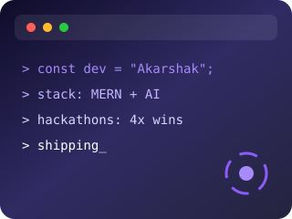
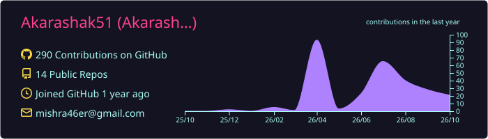
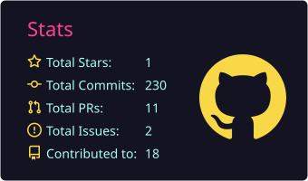
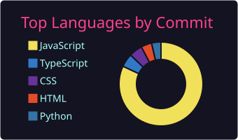
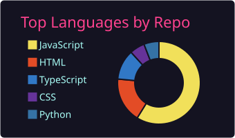
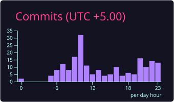

<div align="center">


<br/>


<br/><br/>

<a href="https://portfolio-9ib6.vercel.app"></a>
<a href="https://linkedin.com/in/akarashak-mishra"></a>
<a href="mailto:akarshakmishra607@gmail.com"></a>

</div>

## 👨‍💻 About Me



```js
const akarshak = {
  location: "Prayagraj, India 🇮🇳",
  role: ["Full-Stack Developer", "AI-Agent Engineer"],
  stack: ["MERN", "FastAPI", "Redis", "Celery", "Gemini"],
  achievements: "4x national hackathon winner & team lead",
  currentlyBuilding: "Multi-agent LLM systems & scalable backends",
  motto: "Engineering with intent. Building with impact."
};
```

- 🏆 Led two 4-member engineering teams and shipped **Fullprep** & **Enginow Ignite** to production
- 🔐 Strong focus on backend architecture, API security, and real-time systems
- 🤖 Built AI-powered workflows, document pipelines, and job-discovery platforms

<br clear="right"/>

## 🛠️ Tech Stack

<div align="center">

**Languages**


**Frameworks & Tools**


**Cloud & DevOps**


</div>

## 📊 GitHub Stats

<div align="center">









<br/>


</div>

<div align="center">

<picture>
  <source media="(prefers-color-scheme: dark)" srcset="https://raw.githubusercontent.com/Akarashak51/Akarashak51/output/github-contribution-grid-snake-dark.svg" />
  <source media="(prefers-color-scheme: light)" srcset="https://raw.githubusercontent.com/Akarashak51/Akarashak51/output/github-contribution-grid-snake.svg" />
  
</picture>

</div>

## 🚀 Featured Projects

| Project | What it does | Stack |
|---|---|---|
| 🔍 **[Job Finder](https://github.com/Akarashak51/Job-Matcher)** | Aggregates jobs across Greenhouse, Lever, Ashby, Workday and more; Job Watcher scans 300+ companies and scores the shortlist with Gemini |    |
| 🧠 **[Synthesis-AI](https://synthesis-ai-drab.vercel.app)** | 3-stage multi-agent pipeline (Extractor → Synthesis → Orchestrator) turning PDF/DOCX/images into LLM reports, with OCR fallback |     |
| 🎯 **Fullprep** | AI coding-practice platform with Gemini hints, debugging, complexity analysis, Redis leaderboard and sandboxed execution |    |
| 🛒 **SkillSphere** | Role-based marketplace backend: 15 REST modules, 14 data models (gigs, proposals, payments, disputes) |   |

## 💼 Experience

- **Enginow** — Full Stack Developer Intern & Team Lead *(May 2026 – Aug 2026)*
- **Nayoda** — Full Stack Developer Intern *(Jun 2026 – Jul 2026)*

## 🏅 Achievements

- 🥇 Winner & Team Lead — Devfusion Hackathon, Enginow x IIT Bombay
- 🥇 Winner — 3SVK Hackathon
- 🥉 Top 3 — ACPC AlgoHour 3.0, Amity University
- 🎖️ Certificates of Excellence — CodeFest'26 (IIT BHU), CodeSpark 72-Hour Build

<div align="center">


</div>
